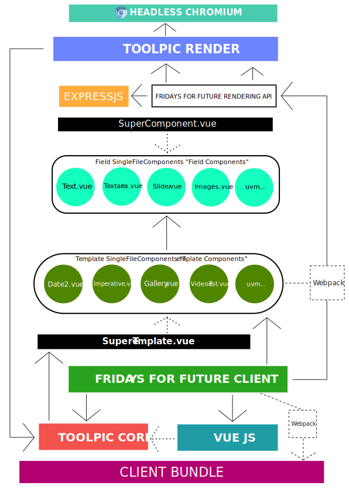

# Toolpic Core
Core processor of Toolpic, developed for Fridays For Future. This is not the whole project but the core library, that is used by the client and the rendering server.

## Disclaimer

Before you are able, to understand *ToolpicCore* and the related software around such as the default client or any rendering system, you should be familiar with the following:
* [VueJS](https://vuejs.org/v2/guide/)
* [Vue Components](https://v1.vuejs.org/guide/components.html)
* [Vue Single File Components](https://vuejs.org/v2/guide/single-file-components.html)
* [Webpack](https://webpack.js.org)

## Structure




## Install

```bash
$ npm install toolpic
```


# Usage


**Please note, that the Toolpic is an UMD module, that is made to be used within an environment that supports UMD modules**
**If you want to use toolpic independently as a standalone system, you have to import the module into global scope using a** `<script>` **tag**


### Example
```javascript
import * as Toolpic from 'toolpic';

console.log(Toolpic);
```

## Import into global scope

To import Toolpic straight into your global scope, use the `toolpic.js` file within the `lib` folder or just *jsdelivr*'s npm cdn.

```html
<head>
  <script src="https://cdn.jsdelivr.net/npm/toolpic@latest/lib/toolpic.js" charset="utf-8"></script>
</head>
```

**Disclaimer 2:** The toolpic project is divided into a lot of projects such as this *toolpic core* but also a (server) rendering API, a server implementation and, of course, a client implementation. The default client implementation is the one, we've developed for Fridays For Future. Because the way, template modules are designed, is related to some other parts of the toolpic project, this documentation also explains these parts even if they are not a part of *toolpic core*. But they are reproduceable and the recommended way how to use it even if you implement your own use case.

# Toolpic Core

```javascript
// Import Renderer
import Toolpic from 'toolpic';

// 'templateModuleNameSpace' is an imported object containing a pre-compiled VueComponent and some additional properties

const render = new Toolpic(templateModuleNameSpace);
// Ready to use
```

The *toolpic core* system works with pre-compiled *VueComponents* that can be rendered using the `render()` function. So, note:
* Each template **needs to be** a valid *VueComponent* that is pre-compiled.
* Because we're normally using `.vue` *Single File Components* as templates, the template object looks like a *ModuleNameSpaceObject* and the component lives on the `default` property.

## API

With your constructed `Toolpic` instance you can do certain things, that are more less controlling the *VueComponent* behind it. To understand the behaviour of some methods (e.g. `seekAnimations()`) it is useful to read the whole documentation including the part about structuring a templates.

### `data`

The `data` controller is a proxy that connects your instance straight to the data controller of the *VueComponent* behind.

#### [GET] `data`

If you are **getting** any property within `data` such as `data.foo`, you get an object containing the requested `key` and the `__value`.

E.g, the return of `render.data.foo` would be:

```javascript
{
  key: 'foo',
  __value: 'bar'
}
```

#### [SET] `data`

To set any property, just do as you would do normally with objects:
```javascript
render.data.foo = 'bar';
```

### `dataset`

To get or set the data to the *VueComponent*'s data controller, you also could use `dataset`. When **getting** `dataset` object returns all properties within the VueComponent's data controller as a new assigned object.

If you are **setting** `dataset`, all properties will hardly overwrite the existing ones within the *VueComponent*'s data controller.


```javascript
const allData = render.dataset;

// Overwrite data
render.dataset = {
  foo: 'bar'
}
```

### Events

#### `load`

The `load` event will be fired when all (new) resources within your template are loaded. Currently this events is listening for `` and `<image>` elements.

```javascript
// Template was initialized or updated before... (whatever)
render.on("load", function() {
  // Now all resources were loaded
});
```

#### `update` or `set`

The `update` (alias `set`) event will be fired when any update occurs on the `data` controller of your instance.

```javascript
render.on("update", function() {
  // Some data updated
});
```

#### `kill`

The `kill` events will be fired when the `kill()` method is applied (destroys the VueComponent)

### Methods

#### `restartAnimations()`

This method is used to restart all animations that are returned by `__animate()` method within the `methods` object of your (template) component.
More about that below.

#### `seekAnimations(timestamp)`

This method is used to seek alls animations to a given timestamp.

#### `kill()`

`kill()` emits the `kill` event and destroys the VueComponent.


## Directives

Theoretically you could set every possible mathematically relation just using the properties and **Vue.js**. **But** sometimes this would need expressions that are too long to handle. Some of these situations are solved by *Toolpic Vue Directives*. These are directives that bundled with `toolpic` and provided by `SuperTemplate` which you should use to extend from by default.

**Remember:** Because each template is a valid *VueComponent*, you could also ship specific directives or custom components just for one single component.

Anyway, the *Toolpic Vue Directives* also can be imported manually from `toolpic` module:
```javascript
import { VueDirectives } from 'toolpic';
```

### v-dynamic

`v-dynamic` is a pretty cool directive that handles a dynamic size of any element you want to.
In detail, this means that the element scales up to a **maximum width** or a **maximum height** but never gets bigger than any of them.

```xml
<g v-dynamic data-dynamic-width="1100" data-dynamic-height="700" style="transform-origin: 50% 50%;">
  <!--any content here-->
  <text style="font-size: 42px; alignment-baseline: middle; text-anchor: middle;" x="50%" y="50%">
    My dynamic Text
  </text>
  <!--any content here-->
</g>
```

This is very cool to use if you have an element that has a dynamic size, you do not know when developing a template (Mostly text elements).


### v-pos

This positioning directive will translate the element relative to its own boundings to an absolute position within the graphic. Using this directive makes it possible, to originate any element dynamically related to its size in real-time.

```xml
<g v-pos data-rel="0.5 0.5" data-pos="600 600">
  <!--
    Center of <g> (0.5,0.5) will be at 600,600 (absolute position in view box)
  -->
</g>
```

### v-scaleimage

Often, an image has to fit into a rect as `background-size: cover` would normally do. Because this is not offered by SVG, you can use the `v-scaleimage` directive to get the same result.

```xml
<image v-scaleimage="0" xlink:href="<url>" x="0" y="0" height="1200" width="1200" />
```

The value of `v-scaleimage` is the position of the image relative to its own size. It is a value between `-1` and `1` (`-1` = 100% left or top and `1` 100% right or bottom). The `transform-origin` should always be at center because, `transform` methods are used to scale and fit the image.

**Note**: Because the directive is just scaling the image up, it **is not** cropped by default. Depending on the use case, a *mask* or *clip-path* cropping the image would be nice.

## Toolpic Custom Components

Some other routines are solved with *Toolpic Vue Custom Components*. As the directives, they are shipped trough the `toolpic` core system too. They also are provided by `SuperTemplate` which you should use to extend from by default.

Anyway, the *Toolpic Vue Custom Components* also can be imported manually from `toolpic` module:
```javascript
import { VueComponents } from 'toolpic';
```


### Multline Text

Often, you have a an array of text lines that need to be formatted correctly. Because SVG does not offer any clean solution, you would need to create a Vue `v-for` loop each time that handles the padding, margin, line height and all the other stuff.

To automate this routine, you can use the `<multiline-text>` component. Here, you can pass everything you need just using attributes.

```xml
<multiline-text x="30" y="1195" relative="0.5 0.5" padding="0" v-bind:text="description" lineheight="1.1" background="none" css="font-size: 80px; font-family: 'Jost-300'; fill: #fff;"></multiline-text>
```

* `relative`: Two values between `0-1` that are describing the origin point that is used to set the element#s position (`0.5 0.5` = *centered*)
* `lineheight`: Line height
* `text`: Array containing all lines
* `background`: Background color of rect
* `padding`: Padding to background rect
* `css`: Stylesheet for the `<text>` element behind the magic


## Toolpic Helpers

To control data in a routine way, you can use some custom methods that can be accessed within the Vue environment just as the directives or the custom components, there are *Toolpic Vue Helpers*. Such as *Toolpic Vue Custom Components* and *Toolpic Vue Directives*, they are also provided by `SuperTemplate` which you should use to extend from by default.

Anyway, the *Toolpic Vue Helpers* also can be imported manually from `toolpic` module:
```javascript
import { VueHelpers } from 'toolpic';
```

### textToMultilineFormat()

This method takes a given multiline text (Array) to a specific graphically ratio. That means, you do not have to care the user about when to set a linebreak to fit in perfectly into a 1:1 or 16:9 image. For example, it is used within the `Quote` template in which the typed quote has to fit into the image perfectly and a user is not abled to decice the linebreaks while writing the quote.

```javascript
textToMultilineFormat('This is a very long text that is just written down without thinking about potencial linebreaks', 1, 0.3, true)
```

1. `String` that should be formatted to the given ratio (e.g. `1`)
2. Ratio the text has to be formatted to
3. *Chars per line*: Value about the average ratio of each char in the used font (e.g. `0.3` - `0.4`). This depends to the font and is just an average value.
4. Boolean value, wether a more correct algorithm should be used. Just use `false` if it seems to be to slow when using `true`

## Template Structure

**Disclaimer**: What you are doing at this point is not just a part of *toolpic core* (this npm module) but some paradigms are moreless best-practice that are implemented within the default client (Fridays For Future). Because you can program any client using the *toolpic core*, you also could implement your completely own solution for templating (the template sjust need to be valid VueComponents) or a lot of things else.

A pre-compiled template that can be given as argument to `Toolpic` looks like the following:

```javascript
{
  default: {
    name: 'MyTemplate1',
    data: <Function>,
    render: <Function>,
    methods: <Object>,
    directives: <Object>,
    components: <Object>,
  },
  width: 1200,
  height: 1200,
  type: "image",
  format: "jpg",
  fields: [],
  smartActions: []
  alias: "Instagram",
  video: <Object>
}
```

As you can see, the `default` property is just a normal **VueComponent**. Learn more about them [here](https://vuejs.org/v2/guide/components.html).

### Template API Reference

#### `default`

The `default` property represents a pre-compiled *VueComponent*. Read more about them [here](https://vuejs.org/v2/guide/components.html).

But there are some things about any *Template VueComponent* you shuld keep in mind:

**Even if these components are normal VueComponents, some properties or methods are required to access all feautures of Toolpic. E.g,** `__animate()` **within your** `methods` **object is used to animate a** `video` **template. Or the** `data()` **method returns the data controller you are using for templating.** .Read more about that below.

#### `width`

The `width` is used to specifiy the width of any template and while the server rendering process.

#### `height`

The `height` is used to specifiy the height of any template and while the server rendering process.

#### `type`

The `type` is mostly used for display purposes and specifies what kind of `format`'s are aviable.
The value currently can be `image` or `video`.

#### `format`

The `format` depends on what a kind of `type` you specify.
Depending on your `type`, possible values are:

| type    | possible values |
| ----    | --------------- |
| `image` | `jpg`, `png`    |
| `video` | `mp4`, `mov`    |

#### `alias`

The `alias` property is just any string, that will be used as an alias for the current template. This is necessary because in some applications you would group two templates together moreless as "one template" because they are just different in format/ratio (such as 1:1 vs. 16:9). In this cases you need an additional name for each template.

#### `video`

The `video` object contains additional properties that are used for templates of `type`: `video` to specify rendering process such as `frameRate` or encoding paremeters.
Looks like the following:

```javascript
{
  // The duration of the video sequence (that will be previewed and rendered)
  duration: 2000,
  // Frame rate for rendering process (on client side, it is high as possible)
  frameRate: 24,
  // Video codec to encode, please have a look at ffmpeg's accepted vcodec values
  vcodec: "libx264",
  // Pixel format to be used, please have a look at ffmpeg's accepted pix_fmt's values
  pix_fmt: "yuv420p"
}
```

#### `fields`

The `fields` array contains descriptor objects that describe input fields for the client. Read more about *Field Components* below.
A field object looks like the following:
```javascript
{
  // This property will be used by the related Field Component to interact with the data controller of your Template Component
  key: "pos",
  // Just a text that will displayed within the client
  description: "Image Position",
  // Field Component you want to control the 'key'
  component: Slider, // Slider is a FridaysForFuture Client implemented component that hosts a range slider
  // Specific properties that are required by the Field Component above
  // They are absolutely
  props: {
    // In this case of a range slider the minimum range
    min: -1,
    // In this case of a range slider the maximum range
    max: 1,
    // // In this case of a range slider interval steps of the slider
    step: 0.01
  }
}
```

`component` is a *Field Component*, that will be imported locally in your template script. More about them below. For example, with Fridays For Future Germany we are using are `Slider`, `Text` or `Textarea` and a lot more.

#### `smartActions`

The `smartActions` array contains descriptors that describe which properties of the data controller can be attached using *Smart Actions*. *Smart Actions* are the optional elements that popup on your client when you long-hold the preview on touch screen. **Attention**: This property is not fully redesigned for the new API, yo it is not that flexible and modular as you expect when looking at `fields`. Documentation is following...

### Templating

Because a template is just an *moduleNameSpaceObject-looking* object containing a valid pre-compiled *VueComponent* on the `default` key, you possibly could create such a template the way you want.
**But** we recommend to create them as `.vue` SFC, so your template xml/html/svg, your component and your styles are scoped together in one single file.

Because a template is just a valid `VueComponent`, all the properties you want to use within the VueContext, should be declared within the return of your `data()` function.

For example, a template, using a `.vue` SFC looks like the following:

```html
<template>
  <!-- The <svg> element is the root element of our component but theoretically, you could also use any valid html element instead -->
  <svg xmlns="http://www.w3.org/2000/svg" viewBox="0 0 1200 1200">
    <!-- Here, we create a circle element and bind the 'r' attribute to the `radius` property of the component-->
    <circle cx="600" cy="600" v-bind:r="radius"/>
  </svg>
</template>

<style scoped>
  /* Just style our circle here */
  circle {
    fill: #f00;
  }
</style>

<script>
// Import SuperTemplate to provide functionallity from Toolpic Directives, Custom Components and Helpers within our template
  import { SuperTemplate } from 'toolpic';

  export default {
    name: "MyExampleTemplate",
    extends: SuperTemplate,
    data() {
      return {
        radius: 500
      }
    },
    methods: {
      __animate() {
        // -> animate the template here
      },
      // ... any additional methods we want to access in our template context
    }
    directives: {
      // ... any additional vue directives we want to use within our component
    },
    components: {
      // ... any additional child vue components we want to use within our component
    }
  }
  export const width = "1200";
  export const width = "1200";
  export const type = "image";
  export const format = "jpg";
  export const alias = "Instagram";

  export const fields = [
    // Here are the field descriptors
    // Note that you have import each Field Component above to use as value for `component`
  ];

  export const smartActions = [
    // SmartAction descriptor objects (Disclaimer above)
  ];

</script>
```

### Field Components

If you describe a field using a *field descriptor object* within the `fields` array, you have to set the `component` property. This should be a *Field Component*, but what is such a *Field Component*? At the end, a *Field Component* is just a valid *VueComponent* that is interacting with your client. The client implementation of FridaysForFuture also provides a `SuperComponent` that you extend when creating your own Field Component. This is recommended because this `SuperComponent` just handles some basic thing such as an easy updating communication to the client. Basically your component should emit an `update` event containing the `key` and `value` you want to update on any Toolpic instance (client-side implementation required, of course). Because your component is designed to be used not just for **one specific key** of a template but to be used for any amount of different templates controlling any possible key, the component does not know which `key` should be emitted if you do not give the trough `params` when mounting the component (on client-side of course). To avoid that we have to implement this logic each time we create a new Field Component, there is a very cool `SuperComponent` that handles this using `$__key` as property/attribute. The Fridays For Future Toolpic implementation uses this property when mounting a component, and we recommend to use the same. The `SuperComponent.vue` can be found within the default client but you also can just have a look here:

```javascript
export default {
  // $__key is internal property that ships the related key
  props: ["$__key"],
  data() {
    return {
      value: null
    };
  },
  watch: {
    value() {
      this.$emit("update", this.$__key, this.value);
    }
  }
}
```

With basic knowledge of JS and Vue, the benefit is clear: When we **extend** our Field Component with this *Super Component*, we just have to **set** the `value` property and the `update` event will be fired. Of course, the client has to bind the `$__key` property when mounting the component. And of course, the client has to listen to the `update` event.

The implementation in FridaysForFuture's client is (simplified) the following:


```html
<div v-for="fields in fields" >
  <component v-bind:is="field.component" v-bind="Object.assign(field.props, { $__key: field.key })" ref="fieldComponents"></component>
</div>
```

This would loop trough an `fields` array. This array should be the exported `fields` array from the **active template** (what makes sense).
The component we are mounting is binded trough `is` attribute (Vue Syntax) and we also bind the component specific properties (such as `min`, `max`, `step`) + `$__key`.

Our Field Component could look like the following (`.vue` SFC):

```html
<template>
  <div class="wrapper">
    <input type="range" v-model="value" v-bind:min="min" v-bind:max="max" v-bind:step="step">
  </div>
</template>

<style scoped>
  .wrapper {
    /* Not really a beautiful border but good enough for documentation purposes */
    border: 1px solid #000;
  }
</style>

<script>
  // Import Super Component to extend from
  import SuperComponent from '../SuperComponent';

  export default {
    extends: SuperComponent,
    props: ["min", "max", "step"],
    data() {
      // Because we are directly model/bind the 'value' property, we do not need additional properties initialized here
      return {}
    }
  }
</script>
```

#### Sounds weird?

Maybe, the modular system with Vue SFC's and everything is not that easy to understand when you're not familiar with front-end development tools as Vue or webpack. If you are not completely understanding the workflow and the dependencies:
* Have a look at **Vue.js Offical Documentation**: [Vue Basics](https://vuejs.org/v2/guide/), [Vue Components](https://v1.vuejs.org/guide/components.html), [Vue Single File Components](https://vuejs.org/v2/guide/single-file-components.html)
* Have a look at some templates within ur FridaysForFuture Toolpic client (recommended). The `.vue` files there will explain a lot own their own.
* Ask us

### Animate a video

To animate a video, you need to return an array containing **animejs** instances within the `__animate()` function you can define within `methods` object in your template. To access elements within the template you should use Vue's `ref` attribute.

A template component that exports an `__animate()` function would look like this:

```javascript
import animejs from 'animejs';

export default {
  data() {
    return {
      // Any data to return
    }
  },
  methods: {
    __animate() {
      const instance1 = animejs({
          // This reference should be set by the template
          targets: this.$refs.element1,
          keyframes: [
            {
              opacity: 1,
              scale: 1
            }
          ],
          duration: 1500,
          autoplay: true,
          easing: 'easeInOutQuad'
        });

        return [
          instance1
        ];
    }
  }
}
```
